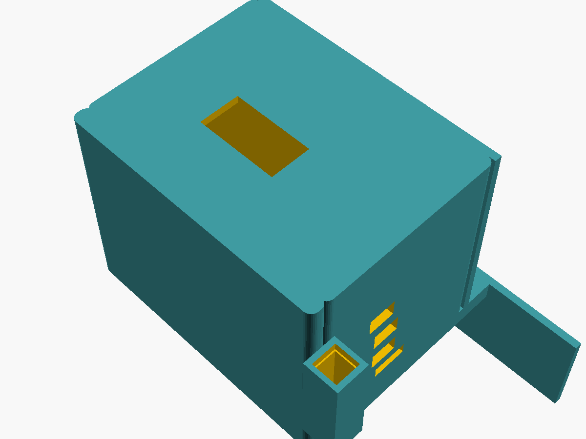

# OctoMount

A 3D-printable mounting enclosure that attaches a **Raspberry Pi 4B** with **MPI4008 4" LCD touchscreen** to an **Ender 3 Pro** 3D printer frame.

Designed for use with [OctoPrint](https://octoprint.org/) — giving you a compact, integrated control panel mounted directly on your printer.



> Preview auto-generated from `cad/assembly.scad` via `scripts/render_preview.sh`.
> Re-run the script after any CAD change to keep this image current.

---

## Hardware

| Component | Model | Notes |
|---|---|---|
| Single Board Computer | Raspberry Pi 4B | 2GB/4GB/8GB variants |
| Display | MPI4008 (LCDwiki 4" HDMI Display-C) | 800×480 IPS, resistive touch |
| Printer | Creality Ender 3 Pro | 4040 aluminum extrusion frame |

### MPI4008 Display Specs

- **Size:** 4.0 inch IPS
- **Resolution:** 800 × 480
- **Touch:** 4-wire resistive
- **Interface:** HDMI (video) + 13×2 GPIO header (power + touch)
- **Module dimensions:** 143 × 134 × 51 mm (with RPi stacked)

### Raspberry Pi 4B Specs

- **Dimensions:** 85 × 56 × 17 mm
- **Ports used:** HDMI micro (to LCD), USB-A (printer connection), USB-C (power in)

---

## Design Overview

OctoMount is a **2-piece design** — Base and Cover — that replaces the Ender 3 Pro control box front panel:

- **Base** — single printed part that serves as both the mounting bracket and the enclosure body. It bolts to the 4040 control-box beam using the existing two M5 diagonal screw holes, covers the stock front panel, and houses the RPi 4B, LM2596 buck converter, and full-size SD slot.
- **Cover** — angled lid that snaps/screws onto the Base. The front face is cut at 45° to tilt the MPI4008 LCD toward the operator. Attaches with 4× M3 screws.

### Mounting Strategy

The Base plate bolts directly to the end face of the Ender 3 Pro 4040 control-box beam using **2× M5 flat-head screws** in the existing diagonal hole pattern (top-left at 10,10 mm; bottom-right at 30,30 mm). Longer M5 screws pass through the Base plate and original plastic panel into the beam — no new holes required.

### Port Routing

| Port | Location | Purpose |
|---|---|---|
| Full-size SD slot | Left wall of Base | Ender 3 Pro microSD extension (print file access) |
| USB-A | Back wall of Base | Cable to Ender 3 Pro mainboard USB (routed through control box) |
| USB-C power | Right-bottom corner of Base | 5V from LM2596 buck converter, entering via 4040 T-slot channel |
| Micro HDMI | Internal | RPi → MPI4008 LCD (inside enclosure) |

---

## Project Goals

- [x] Design a 2-piece 3D-printable enclosure for RPi 4B + MPI4008 LCD + LM2596 buck converter
- [x] Mount to the Ender 3 Pro 4040 beam end face via existing M5 screw holes
- [ ] Power from Ender 3 Pro 24V PSU via LM2596 buck converter (→ 5V USB-C for RPi)
- [ ] Expose full-size SD slot on left wall (extended from Ender 3 Pro microSD)
- [ ] Route USB-A cable from Ender 3 Pro mainboard through back wall to RPi
- [ ] LCD at 45° tilt toward operator for comfortable touchscreen use
- [ ] Integrated fan ventilation with permanent dust filter mesh

---

## Deliverables

| File | Description | Status |
|---|---|---|
| `PARTS.md` | Full bill of materials — parts to buy + 3D printed parts list | ✅ Updated |
| `REQUIREMENTS.md` | Full design requirements | ✅ Updated |
| `stl/` | 3D print files (2 parts: Base + Cover) | 🔄 Pending CAD redesign |
| `docs/ASSEMBLY.md` | Enclosure diagram + step-by-step assembly instructions | 🔄 Pending |
| `img/wiring_diagram.png` | Wiring diagram (PSU → buck converter → RPi) | 🔄 Pending |
| `img/preview.png` | Auto-rendered CAD preview (regenerated by `scripts/render_preview.sh`) | ✅ Active |
| `img/renders/` | Final high-quality CAD renders | 🔄 Pending CAD |

---

## 3D Printed Parts

| Part | Description |
|---|---|
| Base | Mounting plate + arm shelf + enclosure walls + RPi bosses + SD slot + buck converter mount |
| Cover | Angled lid (45° front-top face) with LCD window cutout; attaches with 4× M3 screws |

---

## Repository Structure

```
OctoMount/
├── README.md
├── REQUIREMENTS.md        # Full design requirements
├── STATUS.md              # Project phase tracker
├── PARTS.md               # Bill of materials
├── cad/                   # OpenSCAD source files
├── stl/                   # Export-ready STL files for printing
│   ├── Base.stl
│   └── Cover.stl
├── docs/
│   └── ASSEMBLY.md        # Assembly instructions
├── scripts/
│   └── render_preview.sh  # Regenerate img/preview.png from CAD
└── img/                   # Renders, wiring diagram, photos
    └── preview.png        # Auto-rendered CAD preview
```

---

## Software

- [OctoPrint](https://octoprint.org/) — web-based 3D printer control
- [OctoPi](https://github.com/guysoft/OctoPi) — Raspberry Pi OS image with OctoPrint pre-installed
- [LCD driver (goodtft)](https://github.com/goodtft/LCD-show) — MPI4008 display driver (`sudo ./MPI4008-show`)

---

## Printing Notes

- Material: PETG recommended (heat resistance near printer)
- Layer height: 0.2 mm
- Infill: 30%+
- Supports: Minimal (design oriented to minimise overhangs)

---

## License

[MIT](LICENSE) — free to use, modify, and share.
